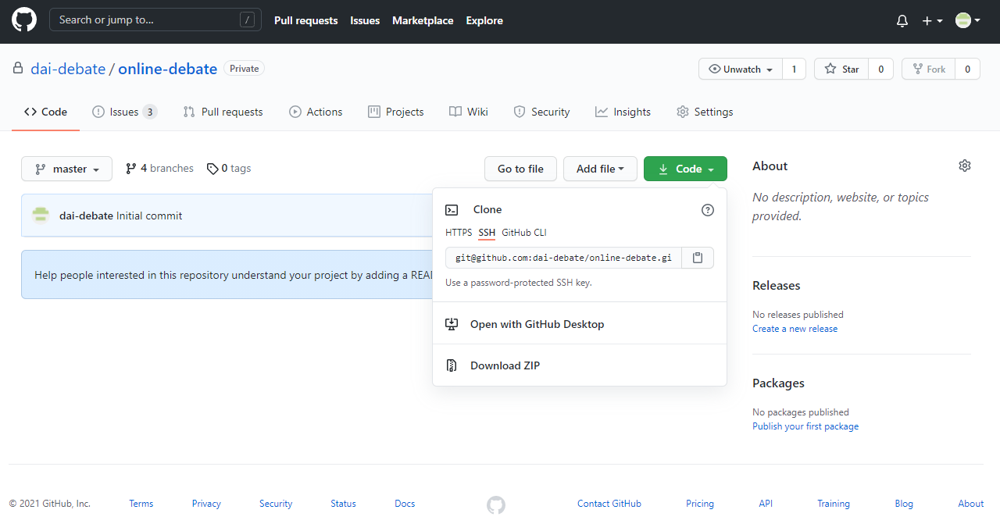

# オンラインディベート運営支援ツール一式の取得

## Zipアーカイブを用いる場合

Gitについて詳しくない場合、1回のみの使用で更新などを考慮しない場合はこちらの方法を採って下さい。

* [運営支援ツールのGithubページ](https://github.com/dai-debate/online-debate)を開き、「Code」→「Download Zip」を選択してダウンロードします。
  
* PC内の適当なフォルダにZipの内容を展開します。

## GitHub Desktopを用いる場合

最新の更新を常に取得したい場合、修正案の提案を行いたい場合等はこちらの方法を採って下さい。

* [GitHub Desktopの公式サイト](https://desktop.github.com/)からGitHub Desktopをダウンロードし、インストールします。
* GitHub Desktopを立ち上げ、メニューの「File」→「Clone repository」を選択します。
  * 開いたダイアログの「URL」タブを選択→「Repository URL or Github username and repository」の欄に `dai-debate/online-debate` と入力します。
  * 「Local path」欄に一式を保存したいフォルダを指定します。
  * 「Clone」ボタンをクリックして下さい。

## Gitを用いる場合

Git (CUI)に精通している方は、以下のコマンドを実行して一式を取得して下さい。

```console
git clone https://github.com/dai-debate/online-debate.git
```

[→次の手順に進む](google-api.md)
